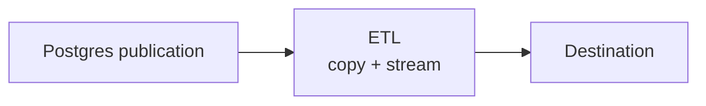

<br />
<p align="center">
  <a href="https://supabase.com">
    <picture>
      
    </picture>
  </a>

  <h1 align="center">ETL</h1>

  <p align="center">
    <a href="https://github.com/supabase/etl/actions/workflows/ci.yml">
      
    </a>
    <a href="https://coveralls.io/github/supabase/etl?branch=main">
      
    </a>
    <a href="https://github.com/supabase/etl/actions/workflows/docs.yml">
      
    </a>
    <a href="https://github.com/supabase/etl/actions/workflows/docker-build.yml">
      
    </a>
    <a href="https://github.com/supabase/etl/actions/workflows/audit.yml">
      
    </a>
    <a href="LICENSE">
      
    </a>
    <br />
    Build real-time Postgres replication applications in Rust
    <br />
    <a href="https://supabase.github.io/etl"><strong>Documentation</strong></a>
    ·
    <a href="https://github.com/supabase/etl/tree/main/etl-examples"><strong>Examples</strong></a>
    ·
    <a href="https://github.com/supabase/etl/issues"><strong>Issues</strong></a>
  </p>
</p>

ETL is a Rust framework by [Supabase](https://supabase.com) for building
high-performance, real-time data replication apps on Postgres.

It sits on top of Postgres
[logical replication](https://www.postgresql.org/docs/current/protocol-logical-replication.html)
and gives you Rust-native building blocks for copying existing data, streaming
ongoing changes, and writing them to your own destination. Run it as a
standalone replicator binary or embed it as a library in your own Rust service.

ETL is intentionally cheap to operate: it is one lightweight Rust process on
top of Postgres logical replication. You do not need Kafka, Flink, Debezium, or
another coordination service to run a pipeline.

## What ETL Does



ETL runs as one process that coordinates an initial copy, a continuous
replication stream, and a state/schema store for recovery:

1. **Initial copy** backfills the existing rows covered by a Postgres publication.
2. **Streaming replication** forwards ongoing inserts, updates, deletes, truncates, and schema events.
3. **State recovery** lets a durable store resume table state, schema versions, and destination metadata after restarts.

## Why ETL?

| Capability | What it gives you |
| --- | --- |
| Real-time replication | Stream Postgres changes as they happen. |
| Initial copy | Backfill existing table data before CDC begins. |
| Schema changes | Track simple DDL changes today; destination-specific DDL behavior is documented in [Schema Changes](https://supabase.github.io/etl/explanation/schema-changes/). |
| Cheap operations | Run one lightweight Rust process without Kafka, Flink, Debezium, or extra control-plane infrastructure. |
| Library or binary | Use ETL as a standalone replicator or embed it in your own Rust application. |
| Configurable throughput | Tune batching, parallel table sync, retries, and memory backpressure. |
| Extensible runtime | Implement custom destinations and state/schema stores. |
| Typed Rust API | Work with structured events, rows, schemas, and errors. |

## Requirements

ETL officially supports and tests against **PostgreSQL 14, 15, 16, 17, and
18**.

- **PostgreSQL 15+** is recommended for advanced publication features:
  - Column-level filtering
  - Row-level filtering with `WHERE` clauses
  - `FOR ALL TABLES IN SCHEMA` syntax
- **PostgreSQL 14** is supported with table-level publication filtering.

For detailed configuration instructions, see the [Configure Postgres documentation](https://supabase.github.io/etl/guides/configure-postgres/).

## Get Started

ETL is currently installed from Git while we prepare for a crates.io release.
Choose the destination features you need.

For a first production deployment, start with the stable BigQuery module:

```toml
[dependencies]
etl = { git = "https://github.com/supabase/etl" }
etl-destinations = { git = "https://github.com/supabase/etl", features = ["bigquery"] }
tokio = { version = "1", features = ["full"] }
```

Then create a pipeline that reads from a Postgres publication and writes to
BigQuery.

```rust
use etl::{
    config::{
        BatchConfig, InvalidatedSlotBehavior, MemoryBackpressureConfig, PgConnectionConfig,
        PipelineConfig, TableSyncCopyConfig, TcpKeepaliveConfig, TlsConfig,
    },
    pipeline::Pipeline,
    store::MemoryStore,
};
use etl_destinations::bigquery::BigQueryDestination;

#[tokio::main]
async fn main() -> Result<(), Box<dyn std::error::Error>> {
    let pg = PgConnectionConfig {
        host: "localhost".into(),
        port: 5432,
        name: "mydb".into(),
        username: "postgres".into(),
        password: Some("password".to_string().into()),
        tls: TlsConfig { enabled: false, trusted_root_certs: String::new() },
        keepalive: TcpKeepaliveConfig::default(),
    };

    let store = MemoryStore::new();
    let pipeline_id = 1;
    let destination = BigQueryDestination::new_with_key_path(
        "my-gcp-project".into(),
        "my_dataset".into(),
        "/path/to/service-account-key.json",
        None,
        1,
        pipeline_id,
        store.clone(),
    )
    .await?;

    let config = PipelineConfig {
        id: pipeline_id,
        publication_name: "my_publication".into(),
        pg_connection: pg,
        batch: BatchConfig {
            max_fill_ms: 5000,
            memory_budget_ratio: 0.2,
        },
        table_error_retry_delay_ms: 10_000,
        table_error_retry_max_attempts: 5,
        max_table_sync_workers: 4,
        max_copy_connections_per_table: PipelineConfig::DEFAULT_MAX_COPY_CONNECTIONS_PER_TABLE,
        memory_refresh_interval_ms: 100,
        memory_backpressure: Some(MemoryBackpressureConfig::default()),
        table_sync_copy: TableSyncCopyConfig::default(),
        invalidated_slot_behavior: InvalidatedSlotBehavior::default(),
    };

    // Start the pipeline.
    let mut pipeline = Pipeline::new(config, store, destination);
    pipeline.start().await?;

    // Wait for the pipeline indefinitely.
    pipeline.wait().await?;

    Ok(())
}
```

For a guided walkthrough, start with
[Your First Pipeline](https://supabase.github.io/etl/guides/first-pipeline/).
For runnable destination examples, see [`etl-examples`](etl-examples/README.md).

## Destinations

ETL is designed to be extensible: you can implement your own destination, or use
one of the modules shipped in `etl-destinations`.

| Feature | Destination | Status | Notes |
| --- | --- | --- | --- |
| `bigquery` | Google BigQuery | Stable | Full CRUD-capable replication for analytics workloads. |
| `ducklake` | DuckLake | In progress | Open data lake replication with local or S3-compatible storage. |
| `iceberg` | Apache Iceberg | Deprecated for now | The module remains available, but new deployments should prefer BigQuery or DuckLake. |

Enable one or more destination modules with crate features:

```toml
[dependencies]
etl = { git = "https://github.com/supabase/etl" }
etl-destinations = { git = "https://github.com/supabase/etl", features = ["bigquery", "ducklake"] }
```

## Development

See [DEVELOPMENT.md](DEVELOPMENT.md) for setup instructions, migration workflows, and development guidelines.

## Contributing

We welcome pull requests and GitHub issues. We currently cannot accept new custom destinations unless there is significant community demand, as each destination carries a long-term maintenance cost. We are prioritizing core stability, observability, and ergonomics. If you need a destination that is not yet supported, please start a discussion or issue so we can gauge demand before proposing an implementation.

## License

Apache‑2.0. See `LICENSE` for details.

---

<p align="center">
  Made with ❤️ by the <a href="https://supabase.com">Supabase</a> team
</p>
