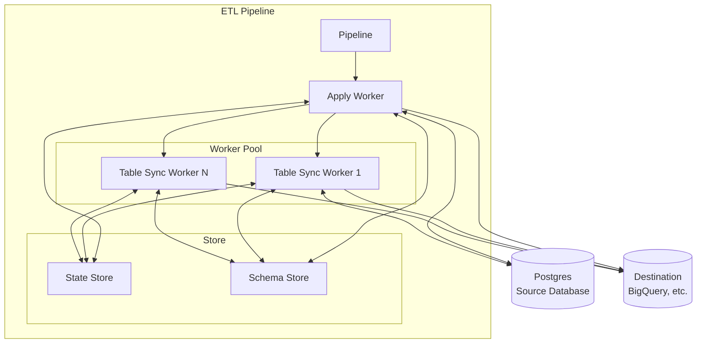

# `etl` - Core Library

This is the main crate of the ETL system. It provides the public pipeline,
configuration, destination, store, schema, event, and row-data APIs used to
build Postgres logical replication applications.

## Features

| Feature                  | Description                                                   |
| ------------------------ | ------------------------------------------------------------- |
| `test-utils`             | Enables testing utilities and helpers                         |
| `failpoints`             | Enables failure injection for testing                         |

## Architecture

The ETL core implements a pipeline architecture that replicates data from Postgres to various destinations.

### Key Components

- **Pipeline**: Main orchestrator that manages the replication process
- **Postgres Client**: Connects to Postgres's logical replication protocol
- **Apply Worker**: Main runtime worker that starts table sync workers and processes CDC events
- **Table Sync Worker**: Handles initial copying of existing table data and processes CDC events until it has caught up
  to the apply worker
- **State Store**: Stores the state of the pipeline
- **Schema Store**: Stores versioned table schemas and prunes obsolete schema versions after acknowledged progress
- **TableStateLifecycleStore**: Provides lifecycle primitives that prepare fresh copies, reset resync state, and delete ETL-owned state for tables removed from a publication

### Information Flow

