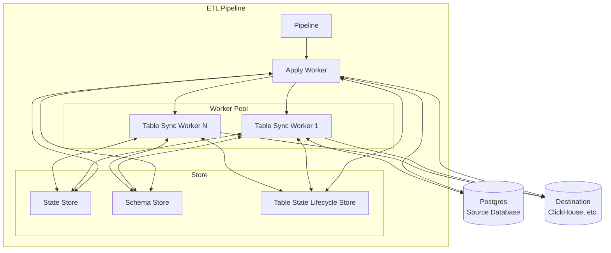

# `etl`

Core library for [Supabase ETL](https://supabase.github.io/etl/). It exposes the
public pipeline, configuration, destination, store, schema, event, and row-data
APIs used to embed Postgres logical replication in a Rust application.

Start with the [First Pipeline](https://supabase.github.io/etl/guides/first-pipeline/)
tutorial, then see [Extension Points](https://supabase.github.io/etl/explanation/traits/)
when you implement a store or destination.

## Features

| Feature      | Description                           |
| ------------ | ------------------------------------- |
| `test-utils` | Enables testing utilities and helpers |
| `failpoints` | Enables failure injection for testing |
| `egress`     | Enables structured billing usage logs |

## Architecture

The crate runs one pipeline per publication in two phases:

1. **Initial sync:** Copy the existing rows selected by the publication, then
   catch up changes that occurred while the copy was running.
2. **Ongoing replication:** Capture subsequent inserts, updates, deletes, and
   truncates, then deliver those changes as ordered events.

Copy and change data capture (CDC) are replication paths, not customer-visible
phases. See the [architecture overview](https://supabase.github.io/etl/explanation/architecture/)
for the worker model.

### Key Components

- **Pipeline**: Main orchestrator that manages the replication process
- **Postgres Client**: Connects to Postgres's logical replication protocol
- **Apply Worker**: Main runtime worker that starts table sync workers and processes CDC events
- **Table Sync Worker**: Copies existing table data, then processes CDC events until it has caught up to the apply worker
- **State Store**: Stores table state, persisted replication checkpoints, and destination metadata
- **Schema Store**: Stores versioned table schemas and prunes obsolete schema versions after acknowledged progress
- **TableStateLifecycleStore**: Prepares fresh copies, resets resync state, and deletes ETL-owned state for tables removed from a publication

### Information Flow

```mermaid
graph TB
    subgraph "ETL Pipeline"
        Pipeline["Pipeline"]

        ApplyWorker["Apply Worker"]

        subgraph "Worker Pool"
            TSWorker1["Table Sync Worker 1"]
            TSWorkerN["Table Sync Worker N"]
        end

        subgraph "Store"
            StateStore["State Store"]
            SchemaStore["Schema Store"]
            LifecycleStore["Table State Lifecycle Store"]
        end
    end

    PG[("Postgres<br/>Source Database")]

    Destination[("Destination<br/>ClickHouse, etc.")]

    Pipeline --> ApplyWorker

    ApplyWorker --> TSWorker1
    ApplyWorker --> TSWorkerN

    ApplyWorker --> Destination
    TSWorker1 --> Destination
    TSWorkerN --> Destination

    ApplyWorker <--> PG
    TSWorker1 <--> PG

    ApplyWorker <--> StateStore
    ApplyWorker <--> SchemaStore
    ApplyWorker <--> LifecycleStore

    TSWorker1 <--> StateStore
    TSWorker1 <--> SchemaStore
    TSWorker1 <--> LifecycleStore

    TSWorkerN <--> StateStore
    TSWorkerN <--> SchemaStore
    TSWorkerN <--> LifecycleStore
```
