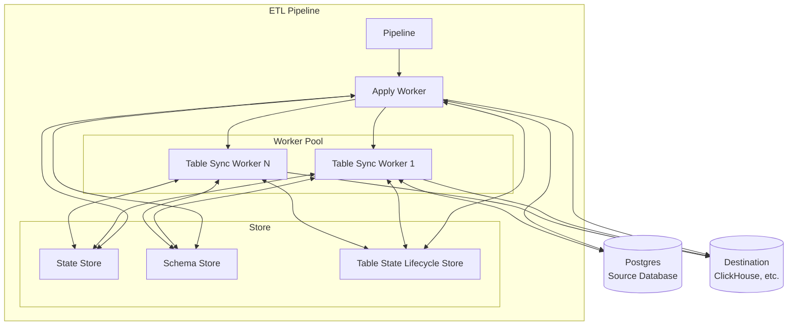

# `etl`

Core library for [Supabase ETL](https://supabase.github.io/etl/). It exposes the
public pipeline, configuration, destination, store, schema, event, and row-data
APIs used to embed Postgres logical replication in a Rust application.

Start with the [First Pipeline](https://supabase.github.io/etl/guides/first-pipeline/)
tutorial, then see [Extension Points](https://supabase.github.io/etl/explanation/traits/)
when you implement a store or destination.

## Features

| Feature      | Description                           |
| ------------ | ------------------------------------- |
| `test-utils` | Enables testing utilities and helpers |
| `failpoints` | Enables failure injection for testing |
| `egress`     | Enables structured billing usage logs |

## Architecture

The crate runs one pipeline per publication in two phases:

1. **Initial sync:** Copy the existing rows selected by the publication, then
   catch up changes that occurred while the copy was running.
2. **Ongoing replication:** Capture subsequent inserts, updates, deletes, and
   truncates, then deliver those changes as ordered events.

Copy and change data capture (CDC) are replication paths, not customer-visible
phases. See the [architecture overview](https://supabase.github.io/etl/explanation/architecture/)
for the worker model.

### Initial-copy locks and beta schema-change handling

The parent copy transaction acquires `ACCESS SHARE` locks on the source table
and its descendants **before** establishing the slot snapshot. It keeps them
until all source copy workers finish. Workers import the same snapshot and use
`NOWAIT` to acquire their own read locks before opening a source relation or
deparsing a filter. Retaining those locks across chunks prevents a lock gap.
Queued incompatible DDL causes a worker to fail rather than wait for DDL that
is itself waiting for its parent. Incomplete copies restart from a fresh
snapshot through the existing retry policy.

Publication discovery determines the copy unit: a published root or subtree
when `publish_via_partition_root = true`, or individual leaves when it is
`false`. Locks cover that unit and its descendants; they do not climb to
ancestors or cover sibling copy units.

Ordinary DML and vacuum remain compatible with the locks. Exclusive DDL can
wait for a long copy and delay later queries; other source lock waits retain
the 30-second lock timeout. Copy protection ends before CDC catch-up and does
not freeze every catalog object.

Schema-change handling is in **public beta**. The trigger captures an
unprojected table schema, and each pipeline combines the WAL-ordered snapshot
with its relation-derived replication mask. This supports different column
lists for the same table and treats publication column-list changes as logical
schema changes without making ordinary table-DDL capture pipeline-specific.

Known limitations include mixed visibility between MVCC catalog reads and
PostgreSQL helper functions, stale snapshots in concurrent DDL transactions,
and ambiguity between publication filtering and mismatched relation metadata.
We are actively investigating these cases and expanding regression coverage.
See [Schema Changes](../../site/content/docs/explanation/schema-changes.mdx)
for the rationale, concrete concurrency example, supported operations, and
recovery guidance; [source migration notes](migrations/README.md#schema-capture-contract-and-limitations)
describe the trigger implementation boundary.

### Key Components

- **Pipeline**: Main orchestrator that manages the replication process
- **Postgres Client**: Connects to Postgres's logical replication protocol
- **Apply Worker**: Main runtime worker that starts table sync workers and processes CDC events
- **Table Sync Worker**: Copies existing table data, then processes CDC events until it has caught up to the apply worker
- **State Store**: Stores table state, persisted replication checkpoints, and destination metadata
- **Schema Store**: Stores versioned table schemas and prunes obsolete schema versions after acknowledged progress
- **TableStateLifecycleStore**: Prepares fresh copies, resets resync state, and deletes ETL-owned state for tables removed from a publication

### Information Flow

```mermaid
graph TB
    subgraph "ETL Pipeline"
        Pipeline["Pipeline"]

        ApplyWorker["Apply Worker"]

        subgraph "Worker Pool"
            TSWorker1["Table Sync Worker 1"]
            TSWorkerN["Table Sync Worker N"]
        end

        subgraph "Store"
            StateStore["State Store"]
            SchemaStore["Schema Store"]
            LifecycleStore["Table State Lifecycle Store"]
        end
    end

    PG[("Postgres<br/>Source Database")]

    Destination[("Destination<br/>ClickHouse, etc.")]

    Pipeline --> ApplyWorker

    ApplyWorker --> TSWorker1
    ApplyWorker --> TSWorkerN

    ApplyWorker --> Destination
    TSWorker1 --> Destination
    TSWorkerN --> Destination

    ApplyWorker <--> PG
    TSWorker1 <--> PG

    ApplyWorker <--> StateStore
    ApplyWorker <--> SchemaStore
    ApplyWorker <--> LifecycleStore

    TSWorker1 <--> StateStore
    TSWorker1 <--> SchemaStore
    TSWorker1 <--> LifecycleStore

    TSWorkerN <--> StateStore
    TSWorkerN <--> SchemaStore
    TSWorkerN <--> LifecycleStore
```
