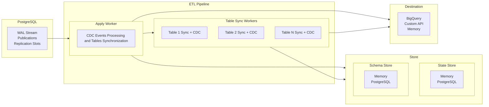

# ETL Architecture Overview

**Understanding how ETL components work together to replicate data from PostgreSQL**

ETL's architecture centers around four core abstractions that work together to provide reliable, high-performance data replication: Pipeline, Destination, SchemaStore, and StateStore. This document explains how these components interact and coordinate data flow from PostgreSQL logical replication to target systems.

A diagram of the overall architecture is shown below:



## Core Abstractions

### Pipeline: The Orchestrator

The Pipeline is ETL's central component that orchestrates all replication activity. It manages worker lifecycles, coordinates data flow, and handles error recovery.

**Key responsibilities:**
- Establishes PostgreSQL replication connection
- Spawns and manages worker processes  
- Coordinates initial table synchronization with ongoing replication
- Handles shutdown and error scenarios

### Destination: Where Data Goes

The Destination trait defines how replicated data is delivered to target systems:

```rust
pub trait Destination {
    fn truncate_table(&self, table_id: TableId) -> impl Future<Output = EtlResult<()>> + Send;
    
    fn write_table_rows(
        &self,
        table_id: TableId,
        table_rows: Vec<TableRow>,
    ) -> impl Future<Output = EtlResult<()>> + Send;
    
    fn write_events(&self, events: Vec<Event>) -> impl Future<Output = EtlResult<()>> + Send;
}
```

The trait provides three operations: `truncate_table` clears destination tables before bulk loading, `write_table_rows` handles bulk data insertion during initial synchronization, and `write_events` processes streaming replication changes.

### SchemaStore: Table Structure Management

The SchemaStore trait manages table schema information:

```rust  
pub trait SchemaStore {
    fn get_table_schema(
        &self,
        table_id: &TableId,
    ) -> impl Future<Output = EtlResult<Option<Arc<TableSchema>>>> + Send;
    
    fn get_table_schemas(&self) -> impl Future<Output = EtlResult<Vec<Arc<TableSchema>>>> + Send;
    
    fn load_table_schemas(&self) -> impl Future<Output = EtlResult<usize>> + Send;
    
    fn store_table_schema(
        &self,
        table_schema: TableSchema,
    ) -> impl Future<Output = EtlResult<()>> + Send;
}
```

The store follows a cache-first pattern: `load_table_schemas` populates an in-memory cache at startup, while `get_*` methods read only from cache for performance. `store_table_schema` implements dual-write to both persistent storage and cache.

### StateStore: Replication Progress Tracking

The StateStore trait manages replication state and table mappings:

```rust
pub trait StateStore {
    fn get_table_replication_state(
        &self,
        table_id: TableId,
    ) -> impl Future<Output = EtlResult<Option<TableReplicationPhase>>> + Send;
    
    fn get_table_replication_states(
        &self,
    ) -> impl Future<Output = EtlResult<HashMap<TableId, TableReplicationPhase>>> + Send;
    
    fn load_table_replication_states(&self) -> impl Future<Output = EtlResult<usize>> + Send;
    
    fn update_table_replication_state(
        &self,
        table_id: TableId,
        state: TableReplicationPhase,
    ) -> impl Future<Output = EtlResult<()>> + Send;
    
    fn rollback_table_replication_state(
        &self,
        table_id: TableId,
    ) -> impl Future<Output = EtlResult<TableReplicationPhase>> + Send;
    
    fn get_table_mapping(
        &self,
        source_table_id: &TableId,
    ) -> impl Future<Output = EtlResult<Option<String>>> + Send;
    
    fn get_table_mappings(
        &self,
    ) -> impl Future<Output = EtlResult<HashMap<TableId, String>>> + Send;
    
    fn load_table_mappings(&self) -> impl Future<Output = EtlResult<usize>> + Send;
    
    fn store_table_mapping(
        &self,
        source_table_id: TableId,
        destination_table_id: String,
    ) -> impl Future<Output = EtlResult<()>> + Send;
}
```

Like SchemaStore, StateStore uses cache-first reads with `load_*` methods for startup population and dual-write patterns for updates. The store tracks both replication progress through `TableReplicationPhase` and source-to-destination table name mappings.

## Data Flow Architecture

### Worker Coordination

ETL's data flow is orchestrated through two types of workers:

**Apply Worker** - The primary replication processor:
- Processes PostgreSQL logical replication stream  
- Spawns table sync workers as needed
- Coordinates with table sync workers through shared state
- Handles final event processing for tables in `Ready` state

**Table Sync Workers** - Initial data synchronization:
- Perform bulk copying of existing table data
- Coordinate handoff to apply worker when synchronization completes
- Multiple workers run in parallel, limited by configured semaphore

### Worker Startup Sequence

The Pipeline follows this startup sequence:

1. **Pipeline Initialization**: Establishes PostgreSQL connection and loads cached state
2. **Apply Worker Launch**: Creates and starts the primary apply worker first  
3. **Table Discovery**: Apply worker identifies tables requiring synchronization
4. **Table Sync Spawning**: Apply worker spawns table sync workers for tables in `Init` state
5. **Coordination**: Workers communicate through shared state store

The apply worker always starts first because it coordinates the overall replication process and spawns table sync workers on demand.

### Table Replication Phases

Each table progresses through distinct phases during replication:

```rust
pub enum TableReplicationPhase {
    Init,
    DataSync, 
    FinishedCopy,
    SyncWait,
    Catchup { lsn: PgLsn },
    SyncDone { lsn: PgLsn },
    Ready,
    Errored { reason: String, solution: Option<String>, retry_policy: RetryPolicy },
}
```

**Phase Ownership and Transitions:**

- **Init**: Set by pipeline when table first discovered
- **DataSync**: Table sync worker begins bulk data copying
- **FinishedCopy**: Table sync worker completes bulk copy, begins catching up with replication stream
- **SyncWait**: Table sync worker requests apply worker to pause (memory-only, not persisted)
- **Catchup**: Apply worker pauses and signals LSN position for table sync worker (memory-only)
- **SyncDone**: Table sync worker catches up to apply worker's LSN and signals completion
- **Ready**: Apply worker takes over all processing for this table
- **Errored**: Either worker encounters unrecoverable error

### Synchronization Handoff

The critical coordination happens during the transition from table sync worker to apply worker control:

1. **Table sync worker** completes bulk copy (`FinishedCopy`)
2. **Table sync worker** processes replication events to catch up
3. **Table sync worker** sets state to `SyncWait` (signals apply worker to pause)
4. **Apply worker** detects `SyncWait` at transaction boundary and pauses
5. **Apply worker** sets state to `Catchup` with current LSN position
6. **Table sync worker** processes events up to the `Catchup` LSN
7. **Table sync worker** sets state to `SyncDone` with final LSN and terminates
8. **Apply worker** detects `SyncDone` and transitions table to `Ready`
9. **Apply worker** resumes processing and handles all future events for the table

This coordination ensures no events are lost during the handoff and that the table reaches a consistent state.

### Event Processing Flow

**Initial Synchronization (Table Sync Worker):**
1. Truncate destination table using `Destination::truncate_table`
2. Copy existing data in batches using `Destination::write_table_rows`
3. Process replication stream events using `Destination::write_events`
4. Coordinate handoff to apply worker

**Continuous Replication (Apply Worker):**
1. Read events from PostgreSQL logical replication stream
2. Filter events for tables in `Ready` state  
3. Batch events for efficiency
4. Send batches to destination using `Destination::write_events`
5. Acknowledge progress to PostgreSQL

### Concurrency and Synchronization

ETL uses several concurrency primitives to coordinate workers:

- **Semaphore**: Limits number of concurrent table sync workers
- **Shutdown channels**: Broadcast shutdown signals to all workers
- **Shared state**: StateStore provides atomic state transitions
- **Message passing**: Workers coordinate through state changes rather than direct communication

The apply worker holds the semaphore permits and distributes them to table sync workers, ensuring resource bounds while allowing parallel initial synchronization.

## Design Rationale

### Cache-First Storage Pattern

Both SchemaStore and StateStore separate loading from reading. This pattern provides:
- **Performance**: Fast cache-only reads during high-frequency operations
- **Consistency**: Dual-write ensures cache and persistent storage stay synchronized
- **Startup efficiency**: Bulk loading minimizes startup time

### Worker Separation

Separating apply workers from table sync workers enables:
- **Parallelism**: Multiple tables can synchronize concurrently
- **Resource control**: Semaphore prevents resource exhaustion
- **Clear handoff**: Explicit phase transitions ensure data consistency
- **Error isolation**: Table-level failures don't affect other tables

### State-Driven Coordination

Using shared state for worker coordination provides:
- **Persistence**: State survives worker failures and restarts
- **Observability**: External systems can monitor replication progress
- **Recovery**: Workers can resume from last known state
- **Simplicity**: No complex message passing between workers

The architecture prioritizes data consistency and operational simplicity over raw throughput, ensuring reliable replication with clear error handling and recovery patterns.