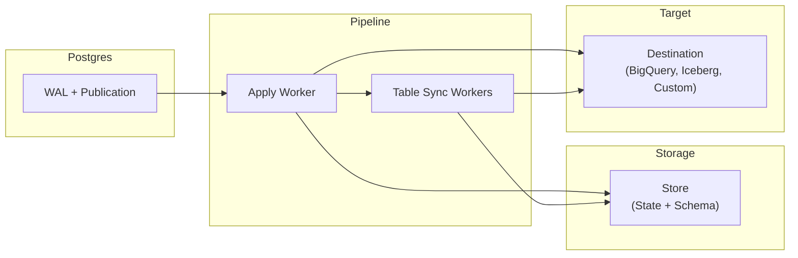

# ETL Architecture

**How ETL replicates data from Postgres to your destinations**

ETL uses Postgres logical replication to stream database changes in real-time.

## Overview



## How It Works

ETL operates in two phases:

### Phase 1: Initial Copy

When a pipeline starts, it copies all existing data from each table in the publication. Multiple **Table Sync Workers** run in parallel to copy tables concurrently. Each worker:

1. Creates a replication slot to capture a consistent snapshot
2. Copies all rows using Postgres `COPY`
3. Sends rows to the destination via `write_table_rows()`

**Note:** During this phase, `Begin` and `Commit` events may be delivered multiple times because workers consume slots in parallel. This is expected and does not cause data duplication - only transaction markers are repeated.

### Phase 2: Continuous Replication

Once tables are copied, the **Apply Worker** streams ongoing changes from the Postgres WAL. It:

1. Receives change events (inserts, updates, deletes)
2. Batches events for efficiency
3. Sends batches to the destination via `write_events()`

## Core Components

### Pipeline

The central orchestrator that manages the entire replication process. It spawns workers, coordinates state transitions, and handles shutdown.

### Destination

Where replicated data goes. Implement the `Destination` trait to send data anywhere:

```rust
pub trait Destination {
    fn name() -> &'static str;
    fn truncate_table(&self, table_id: TableId) -> impl Future<Output = EtlResult<()>> + Send;
    fn write_table_rows(&self, table_id: TableId, rows: Vec<TableRow>) -> impl Future<Output = EtlResult<()>> + Send;
    fn write_events(&self, events: Vec<Event>) -> impl Future<Output = EtlResult<()>> + Send;
}
```

| Method | When called | Purpose |
|--------|-------------|---------|
| `name()` | On initialization | Identify the destination |
| `truncate_table()` | Before initial copy | Clear destination table |
| `write_table_rows()` | During initial copy | Receive bulk rows |
| `write_events()` | After initial copy | Receive streaming changes |

### Store

Persists pipeline state so replication can resume after restarts. Three traits work together:

- **StateStore**: Tracks replication phase per table and source-to-destination table mappings
- **SchemaStore**: Stores table schema information (columns, types, primary keys)
- **CleanupStore**: Removes stored state when a table is dropped from the publication

`StateStore` and `SchemaStore` use a cache-first pattern: reads hit an in-memory cache, writes go to both the cache and persistent storage.

## Delivery Guarantees

ETL provides **at-least-once delivery**. If restarts occur, some events may be delivered more than once. This is a deliberate design choice.

### Why Not Exactly-Once?

Exactly-once delivery requires distributed transactions between Postgres and the destination, adding complexity and latency. Instead, ETL optimizes for throughput and simplicity while minimizing duplicates through:

- **Controlled shutdown**: The pipeline gracefully drains in-flight events before stopping
- **Frequent status updates**: Progress is reported to Postgres regularly, reducing the replay window after restarts

### Handling Duplicates

Destinations should use **primary keys** to deduplicate. When writing to the destination, upsert on the primary key instead of inserting - duplicates naturally overwrite with the same data.

The `start_lsn` and `commit_lsn` fields on events are useful for **ordering and checkpointing**. For example, BigQuery destinations use these to maintain correct event order in destination tables. See [Event Types](events.md#understanding-lsn-fields) for details on LSN semantics.

## Table Replication Phases

Each table progresses through these phases:

| Phase | Set By | Description |
|-------|--------|-------------|
| **Init** | Pipeline | Table discovered, ready for initial copy |
| **DataSync** | Table Sync Worker | Initial table copy in progress |
| **FinishedCopy** | Table Sync Worker | Initial copy complete |
| **SyncWait** | Table Sync Worker | Waiting for Apply Worker to pause (in-memory only) |
| **Catchup** | Apply Worker | Apply Worker paused; Table Sync Worker catching up to its LSN (in-memory only) |
| **SyncDone** | Table Sync Worker | Catch-up complete, ready for handoff |
| **Ready** | Apply Worker | Apply Worker now handles this table exclusively |
| **Errored** | Either | Error occurred; contains reason, solution hint, and retry policy |

## Next Steps

- [Extension Points](traits.md): Implement custom stores and destinations
- [Event Types](events.md): Understand event data
- [First Pipeline](../guides/first-pipeline.md): Build something
- [Configure Postgres](../guides/configure-postgres.md): Database setup
