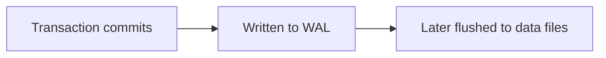
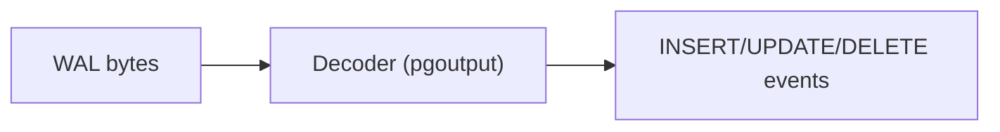
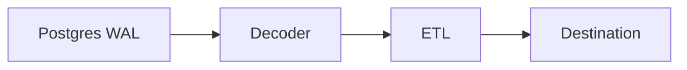

# Postgres Logical Replication Concepts

**Essential background for understanding how ETL works**

This page explains the Postgres concepts that ETL builds on. If you're new to logical replication, read this first.

## What is Logical Replication?

Postgres supports two types of replication:

| Type | What it copies | Use case |
|------|----------------|----------|
| **Physical** | Exact byte-for-byte copy of data files | Disaster recovery, read replicas |
| **Logical** | Decoded row changes (INSERT, UPDATE, DELETE) | Data integration, ETL, CDC |

Physical replication creates identical Postgres instances. Logical replication decodes changes into a format that any system can consume - not just another Postgres server.

ETL uses logical replication to stream changes to destinations like BigQuery, Iceberg, or your custom systems.

## The Write-Ahead Log (WAL)

Before Postgres modifies data on disk, it first writes the change to the **Write-Ahead Log (WAL)**. This guarantees durability - if Postgres crashes, it can replay the WAL to recover.



For logical replication, Postgres decodes the WAL back into logical changes:



ETL receives these decoded events and forwards them to your destination.

### WAL Level

Postgres must be configured to record enough information for logical decoding:

```ini
# In postgresql.conf
wal_level = logical
```

With `wal_level = logical`, Postgres records additional metadata needed to reconstruct row changes. Lower levels (`replica`, `minimal`) don't capture enough detail.

## Publications

A **publication** defines which tables to replicate. Think of it as a filter that says "replicate changes from these tables."

```sql
-- Replicate specific tables
CREATE PUBLICATION my_publication FOR TABLE users, orders;

-- Replicate all tables (use with caution)
CREATE PUBLICATION my_publication FOR ALL TABLES;
```

When you create an ETL pipeline, you specify which publication to consume. Only changes to tables in that publication are streamed.

### What Publications Control

- **Which tables**: Only tables in the publication are replicated
- **Which operations**: You can filter to only INSERT, UPDATE, or DELETE
- **Which columns** (Postgres 15+): Replicate only specific columns
- **Which rows** (Postgres 15+): Filter rows with a WHERE clause

## Replication Slots

A **replication slot** is a bookmark that tracks how far a consumer has read in the WAL.

### Why Slots Exist

Without slots, Postgres would delete old WAL files when it no longer needs them for crash recovery. But if ETL disconnects temporarily, it needs those WAL files to catch up when it reconnects.

Replication slots tell Postgres: "Don't delete WAL files until this consumer has processed them."

```sql
-- View existing slots
SELECT slot_name, confirmed_flush_lsn, active
FROM pg_replication_slots;
```

### How ETL Uses Slots

ETL creates replication slots automatically:

| Slot | Purpose |
|------|---------|
| `supabase_etl_apply_{pipeline_id}` | Main streaming slot for ongoing changes |
| `supabase_etl_table_sync_{pipeline_id}_{table_id}` | Temporary slots for initial table copy |

The Apply Worker uses one persistent slot. Table Sync Workers create temporary slots during initial copy, then delete them.

### Slot Risks

Slots prevent WAL cleanup. If ETL stops consuming (due to crashes, network issues, or a slow destination), WAL files accumulate on disk. This can fill your disk.

To mitigate this risk:

- Monitor slot lag with `pg_replication_slots`
- Set `max_slot_wal_keep_size` to limit WAL retention
- Alert when slots fall behind

See [Configure Postgres](../guides/configure-postgres.md#wal-buildup-and-disk-usage) for details.

## The pgoutput Decoder

When Postgres decodes WAL for logical replication, it uses a **decoder plugin**. ETL uses `pgoutput`, Postgres's built-in decoder.

The decoder transforms binary WAL records into structured messages:

| Message | Meaning |
|---------|---------|
| `BEGIN` | Transaction started |
| `RELATION` | Table schema (columns, types) |
| `INSERT` | Row added |
| `UPDATE` | Row modified |
| `DELETE` | Row removed |
| `TRUNCATE` | Table cleared |
| `COMMIT` | Transaction completed |

ETL receives these messages and converts them to events for your destination.

## Why Two Phases?

ETL replicates data in two phases:

### Phase 1: Initial Copy

Logical replication only captures **changes**. It doesn't know about data that existed before replication started.

So ETL first copies all existing rows using Postgres's `COPY` command:

1. Create replication slot (captures consistent snapshot point)
2. COPY all rows from table to destination
3. Start streaming changes from the snapshot point

The slot ensures no changes are lost between the snapshot and when streaming begins.

### Phase 2: Streaming

After initial copy, ETL streams ongoing changes in real-time:



Each change is delivered as an event (Insert, Update, Delete) to your destination's `write_events()` method.

### Why This Matters

Understanding the two phases helps you:

- Know that initial copy can take time for large tables
- Understand why `write_table_rows()` and `write_events()` are separate methods
- Debug issues where data exists but changes aren't appearing (or vice versa)

## REPLICA IDENTITY

**REPLICA IDENTITY** controls what data Postgres includes in UPDATE and DELETE events.

### The Problem

When a row is updated or deleted, what identifies which row changed? By default, Postgres only sends the primary key - enough to identify the row, but not to see the old values.

### Settings

```sql
-- See current setting (d=default, f=full, n=nothing, i=index)
SELECT relname, relreplident FROM pg_class WHERE relname = 'your_table';

-- Change setting
ALTER TABLE your_table REPLICA IDENTITY FULL;
```

| Setting | What's sent with UPDATE/DELETE | Use case |
|---------|-------------------------------|----------|
| `DEFAULT` | Primary key columns only | Most cases |
| `FULL` | All columns (old values) | Audit logs, CDC requiring old values |
| `NOTHING` | Nothing | Not recommended |
| `USING INDEX` | Columns from specified index | Tables without primary key |

### Impact on ETL

In your destination's `write_events()`, Update and Delete events have an `old_table_row` field of type `Option<(bool, TableRow)>`:

- With `DEFAULT`: Contains `Some((true, row))` where `row` has only primary key columns
- With `FULL`: Contains `Some((false, row))` where `row` has all columns with previous values
- With `NOTHING`: Contains `None`

If you need old values for auditing or comparison, set `REPLICA IDENTITY FULL` on those tables.

## LSN (Log Sequence Number)

Every position in the WAL has a unique **LSN** - a monotonically increasing pointer.

```
Format: 0/16B3748 (segment/offset)
```

### LSNs in Events

ETL events include two LSN fields:

| Field | Meaning |
|-------|---------|
| `start_lsn` | Where this event was recorded in the WAL |
| `commit_lsn` | LSN of the commit message in the WAL |

Multiple events in the same transaction share the same `commit_lsn` but have different `start_lsn` values.

## Why Persist State?

ETL persists replication state (schemas, progress, mappings) for recovery.

### Without Persistence

If ETL crashes and has no state:

- It doesn't know which tables were already copied
- It doesn't know where in the WAL to resume
- It would have to start from scratch, potentially duplicating data

### With Persistence

ETL stores:

| State | Purpose |
|-------|---------|
| Replication phase | Know whether to copy or stream for each table |
| Table schemas | Validate incoming data against expected schema |
| Table mappings | Route events to correct destination tables |

On restart, ETL loads this state and resumes from where it left off.

The built-in `PostgresStore` persists to your Postgres database. `MemoryStore` is for testing only - state is lost on restart.

## Putting It Together

Here's the complete flow:

1. You configure Postgres (`wal_level=logical`)
2. You create a publication for tables you want to replicate
3. ETL creates a replication slot to track progress
4. ETL copies existing data (Phase 1: Initial Copy)
5. ETL streams ongoing changes (Phase 2: Streaming)
6. Postgres decodes WAL using pgoutput
7. ETL receives events and sends them to your destination
8. ETL reports progress back to Postgres (so WAL can be cleaned up)
9. State is persisted for crash recovery

## Next Steps

- [Architecture](architecture.md): How ETL's components work together
- [Event Types](events.md): All events your destination receives
- [Configure Postgres](../guides/configure-postgres.md): Production setup
- [First Pipeline](../guides/first-pipeline.md): Build something
