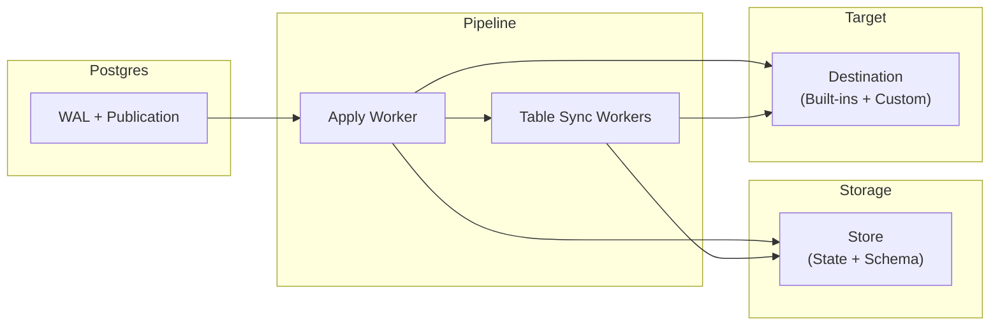

**How ETL replicates data from Postgres to your destinations**

ETL uses **Postgres logical replication** to stream database changes in real time.

## Overview



## How It Works

ETL operates in **two phases**:

### Phase 1: Initial Copy

When a pipeline starts, it copies all existing data from each table in the publication. Multiple **Table Sync Workers** run in parallel to copy tables concurrently. Each worker:

1. Creates a replication slot to capture a consistent snapshot
2. Copies all rows using Postgres `COPY`
3. Sends rows to the destination via `write_table_rows()`

**Note:** During this phase, `Begin` and `Commit` events may be delivered multiple times because workers consume slots in parallel. This is expected: destinations should rely on **per-table event ordering** and **idempotent writes** rather than treating transaction markers as a complete global transaction boundary.

### Phase 2: Continuous Replication

Once tables are copied, the **Apply Worker** streams ongoing changes from the Postgres WAL. It:

1. Receives change events (inserts, updates, deletes)
2. Batches events for efficiency
3. Sends batches to the destination via `write_events()`

### Schema Changes

ETL supports schema changes for simple `ALTER TABLE` column evolution. A
source-side event trigger emits internal DDL messages for published permanent
tables, ETL stores a new schema snapshot, and destinations observe the change
through a fresh `Relation` event before following row events. Today ETL models
column adds, drops, renames, nullability changes, and supported default changes.
See [Schema Changes](/etl/explanation/schema-changes/) for exact semantics and
limitations.

## Core Components

### Pipeline

The **central orchestrator** that manages the entire replication process. It spawns workers, coordinates state transitions, and handles shutdown.

### Destination

Where replicated data goes. Implement the `Destination` trait to send data anywhere:

```rust
pub trait Destination {
    fn name() -> &'static str;
    fn shutdown(&self) -> impl Future<Output = EtlResult<()>> + Send { async { Ok(()) } }
    fn startup(&self) -> impl Future<Output = EtlResult<()>> + Send { async { Ok(()) } }
    fn drop_table_for_copy(&self, replicated_table_schema: &ReplicatedTableSchema, async_result: DropTableForCopyResult<()>) -> impl Future<Output = EtlResult<()>> + Send;
    fn write_table_rows(&self, replicated_table_schema: &ReplicatedTableSchema, rows: Vec<TableRow>, async_result: WriteTableRowsResult) -> impl Future<Output = EtlResult<()>> + Send;
    fn write_events(&self, events: Vec<Event>, durability: WriteEventsDurability, async_result: WriteEventsResult) -> impl Future<Output = EtlResult<()>> + Send;
}
```

| Method | When called | Purpose |
|--------|-------------|---------|
| `name()` | On initialization | Identify the destination |
| `shutdown()` | After ETL stops submitting work | Clean up destination resources, drain writers, or stop background tasks |
| `startup()` | After store caches are loaded, removed-publication tables are purged, and before workers start | Reconcile destination state after process restarts |
| `drop_table_for_copy()` | Before restarting a table copy when previous destination state exists | Drop the existing destination object and destination-private replay state using the previously stored replicated schema |
| `write_table_rows()` | During initial copy | Receive bulk rows or complete a deferred copy durability barrier for the current replicated schema |
| `write_events()` | During catch-up and continuous replication | Receive streaming changes |

Each write-like method receives an async result handle. The intent is different per method:

- `write_events()`: after dispatch succeeds, ETL may keep processing other work while the destination finishes the batch. ETL still waits for that batch's async result before handing the destination the next streaming batch. `MayDefer` permits `Accepted` or `Durable`; `RequireDurable` requires cumulative durable completion. ETL may send an empty `RequireDurable` write as a durability-only barrier for earlier accepted work, but never sends an empty `MayDefer` write.
- `drop_table_for_copy()`: ETL waits for the result immediately. After a successful drop, ETL clears its own copy-scoped schema, destination metadata, and table-sync progress before storing the fresh `0/0` copy schema.
- `write_table_rows()`: ETL waits for each result before requesting the next batch for that copy partition. `Durable` confirms that batch and any earlier accepted writes covered by the result. `Accepted` transfers ownership to the destination and lets copying continue without marking the table copy finished. If any batch is accepted this way, ETL sends a final empty batch after all copy workers finish; that table-wide barrier must cover every accepted write and return `Durable` before ETL stores `FinishedCopy`.

### Store

Persists pipeline state so replication can resume after restarts. **Three traits work together**:

- **StateStore**: Tracks table state, durable replication progress, and destination table metadata
- **SchemaStore**: Stores versioned table schema information (columns, types, primary keys, snapshot IDs) and prunes obsolete schema versions after acknowledged progress while preserving the retained boundary schema and newer versions
- **TableStateLifecycleStore**: Prepares table-copy state, resets table states for resync, and deletes all ETL-owned state when a table leaves the publication

`StateStore` and `SchemaStore` use a cache-first pattern: normal reads hit an in-memory cache, startup loaders hydrate that cache from persistent storage, and writes go to both the cache and persistent storage. `get_table_schema()` may load a missing version from persistent storage, while `get_table_schemas()` returns cached schemas only. Schema pruning follows the same rule for implementations with durable storage: obsolete versions are removed from both the cache and the persistent store.

## Delivery Guarantees

ETL provides **at-least-once delivery**. If restarts occur, some events may be delivered more than once. This is a deliberate design choice.

### Why Not Exactly-Once?

Exactly-once delivery requires distributed transactions between Postgres and the destination, adding complexity and latency. Instead, ETL optimizes for throughput and simplicity while minimizing duplicates through:

- **Controlled shutdown**: The pipeline attempts to finish in-flight work before its shutdown deadline; interrupted work can be replayed after restart
- **Frequent status updates**: Progress is reported to Postgres regularly, reducing the replay window after restarts

### Handling Duplicates

Destinations should make writes **idempotent** using the source table's replica
identity or primary key plus ETL's event ordering metadata. For append-style CDC
tables, persist a sequence key derived from `commit_lsn` and `tx_ordinal`. For
current-state tables, upsert by the destination's chosen row key so replayed
events converge to the same state.

The `start_lsn` and `commit_lsn` fields on events are useful for **ordering and checkpointing**. For example, BigQuery destinations use these to maintain correct event order in destination tables. See [Event Types](/etl/explanation/events/#understanding-lsn-fields) for details on LSN semantics.

## Table States

Each table progresses through these states:

| State | Set By | Description |
|-------|--------|-------------|
| **Init** | Pipeline | Table discovered, ready for initial copy |
| **DataSync** | Table Sync Worker | Initial table copy in progress |
| **FinishedCopy** | Table Sync Worker | Initial copy complete |
| **SyncWait** | Table Sync Worker | Waiting for Apply Worker to pause (in-memory only) |
| **Catchup** | Apply Worker | Apply Worker paused; Table Sync Worker catching up to its LSN (in-memory only) |
| **SyncDone** | Table Sync Worker | Catch-up complete, ready for handoff |
| **Ready** | Apply Worker | Apply Worker now handles this table exclusively |
| **Errored** | Either | Error occurred; contains reason, solution hint, and retry policy |

## Next Steps

- [Extension Points](/etl/explanation/traits/): Implement custom stores and destinations
- [Event Types](/etl/explanation/events/): Understand event data
- [First Pipeline](/etl/guides/first-pipeline/): Build something
- [Configure Postgres](/etl/guides/configure-postgres/): Database setup
