# `etl` - Core

This is the main crate of the ETL system, providing the core functionality for PostgreSQL logical replication. It abstracts the complexities of PostgreSQL's logical streaming replication protocol and provides a unified interface for data replication and transformation.

## Features

| Feature                  | Description                                |
| ------------------------ | ------------------------------------------ |
| `unknown-types-to-bytes` | Converts unknown PostgreSQL types to bytes (enabled by default) |
| `test-utils`             | Enables testing utilities and helpers      |
| `failpoints`             | Enables failure injection for testing      |

## Architecture

The ETL core implements a pipeline architecture that replicates data from PostgreSQL to various destinations.

```mermaid
graph TB
    PostgreSQL["🐘 PostgreSQL"] --> Pipeline["🎭 Pipeline"]
    Pipeline --> Workers["⚙️ Workers"]
    Pipeline --> State["💾 State Store"]
    Workers --> Destination["🎯 Destination"]
    
    subgraph "Pipeline Components"
        ReplicationStream["📡 Replication Stream"]
        TableSync["🔄 Table Sync"]
        CDC["📦 Change Processing"]
    end
    
    Pipeline --> ReplicationStream
    Pipeline --> TableSync  
    Pipeline --> CDC
```

### Key Components

- **Pipeline**: Main orchestrator that manages the replication process
- **Replication Client**: Connects to PostgreSQL's logical replication protocol
- **Apply Worker**: Main worker that handles the creation of table sync workers and processes CDC events
- **Table Sync Worker**: Handles initial copying of existing table data and processes CDC events until it has caught up
  to the apply worker
- **State Store**: Tracks the state of the pipeline
- **Schema Store**: Tracks the table schemas of the tables involved in the replication