# `etl` - Core

This is the main crate of the ETL system, providing the core functionality for PostgreSQL logical replication. It abstracts the complexities of PostgreSQL's logical streaming replication protocol and provides a unified interface for data replication and transformation.

## Features

| Feature                  | Description                                |
| ------------------------ | ------------------------------------------ |
| `unknown-types-to-bytes` | Converts unknown PostgreSQL types to bytes (enabled by default) |
| `test-utils`             | Enables testing utilities and helpers      |
| `failpoints`             | Enables failure injection for testing      |

## Architecture Overview

The ETL core implements a multi-layered architecture designed for high-throughput, reliable data replication from PostgreSQL to various destination systems.

```mermaid
graph TB
    subgraph "ETL Core Architecture"
        Pipeline["🎭 Pipeline<br/>Main Orchestrator"]
        
        subgraph "Replication Layer"
            Client["📡 PgReplicationClient<br/>PostgreSQL Connection"]
            Slot["🎯 Replication Slot<br/>Consistency Point"]
            Stream["🌊 Logical Stream<br/>CDC Events"]
        end
        
        subgraph "Worker Layer"
            ApplyWorker["⚙️ Apply Worker<br/>Event Processor"]
            TableSyncWorkers["🔄 Table Sync Workers<br/>Initial Data Copy"]
            WorkerPool["🏊 Worker Pool<br/>Concurrency Management"]
        end
        
        subgraph "State Management"
            StateStore["💾 State Store<br/>Progress Tracking"]
            SchemaStore["📋 Schema Store<br/>Table Metadata"]
        end
        
        subgraph "Data Processing"
            TypeConversion["🔄 Type Conversion<br/>PG → Destination"]
            EventProcessing["📦 Event Processing<br/>CDC → Structured Data"]
            Batching["📊 Batching<br/>Efficient Grouping"]
        end
        
        Destination["🎯 Destination<br/>BigQuery, etc."]
    end
    
    PostgreSQL["🐘 PostgreSQL<br/>Source Database"] --> Client
    Client --> Slot
    Slot --> Stream
    Pipeline --> ApplyWorker
    Pipeline --> WorkerPool
    WorkerPool --> TableSyncWorkers
    ApplyWorker --> Stream
    ApplyWorker --> EventProcessing
    TableSyncWorkers --> TypeConversion
    EventProcessing --> Batching
    TypeConversion --> Batching
    Batching --> Destination
    Pipeline --> StateStore
    Pipeline --> SchemaStore
    StateStore --> ApplyWorker
    SchemaStore --> ApplyWorker
```



## Core Components

### Pipeline Orchestrator
The **Pipeline** is the main coordinator that manages the entire replication process:
- Establishes connections to PostgreSQL with replication permissions
- Initializes table replication states based on publication contents
- Manages worker lifecycle and coordinates shutdown sequences
- Provides centralized error handling and recovery mechanisms

### Replication System
- **PgReplicationClient**: Manages the connection to PostgreSQL's logical replication protocol
- **Replication Slot**: Ensures consistent point-in-time streaming and prevents data loss
- **Logical Stream**: Processes real-time CDC events (INSERT, UPDATE, DELETE, TRUNCATE)
- **Table Sync**: Handles initial copying of existing table data before streaming begins

### Worker Architecture
The system uses a two-tier worker model for optimal performance:

```mermaid
graph LR
    subgraph "Worker Lifecycle"
        ApplyWorker["Apply Worker<br/>🎯 Single Instance"]
        
        subgraph "Table Sync Pool"
            TSW1["Table Sync Worker 1<br/>📋 Table A"]
            TSW2["Table Sync Worker 2<br/>📋 Table B"]
            TSWn["Table Sync Worker N<br/>📋 Table ..."]
        end
        
        Semaphore["🚦 Semaphore<br/>Concurrency Control"]
    end
    
    ApplyWorker --> TSW1
    ApplyWorker --> TSW2
    ApplyWorker --> TSWn
    Semaphore --> TSW1
    Semaphore --> TSW2
    Semaphore --> TSWn
```



- **Apply Worker**: Single worker that processes the CDC stream and spawns table sync workers as needed
- **Table Sync Workers**: Multiple workers that handle initial table copying, with semaphore-controlled concurrency
- **Worker Pool**: Manages table sync worker lifecycle and provides graceful shutdown coordination

### State Management
The system maintains persistent state to ensure reliability and resumability:

```mermaid
graph TB
    subgraph "Table Replication States"
        Init["🔄 Init<br/>Initial State"]
        Copy["📋 Copy<br/>Copying Data"]
        Stream["🌊 Streaming<br/>Processing CDC"]
        Error["❌ Error<br/>Retry Required"]
    end
    
    Init --> Copy
    Copy --> Stream
    Copy --> Error
    Error --> Copy
    Stream --> Error
    Error --> Stream
```



- **State Store**: Persists replication progress, table states, and LSN positions
- **Schema Store**: Caches table schema information for efficient processing
- **Table States**: Tracks each table's replication phase (Init → Copy → Streaming)

### Data Processing Pipeline
The system transforms PostgreSQL data through several stages:

```mermaid
graph LR
    subgraph "Data Flow"
        PGData["🐘 PostgreSQL Data<br/>Binary Protocol"]
        TypeConv["🔄 Type Conversion<br/>PG Types → Destination"]
        EventProc["📦 Event Processing<br/>CDC → Structured"]
        Batch["📊 Batching<br/>Efficiency Grouping"]
        DestWrite["🎯 Destination Write<br/>BigQuery, etc."]
    end
    
    PGData --> TypeConv
    TypeConv --> EventProc
    EventProc --> Batch
    Batch --> DestWrite
```



## Replication Process Flow

The ETL system follows a well-defined process for each table:

1. **Initialization Phase**
   - Verify publication exists and contains target tables
   - Create or connect to replication slot
   - Initialize table replication states

2. **Table Sync Phase**
   - Spawn table sync workers for tables in "Init" state
   - Use consistent snapshot from replication slot
   - Copy existing table data to destination
   - Track progress and handle errors with retry logic

3. **Streaming Phase**
   - Process CDC events from logical replication stream
   - Transform events into destination-appropriate format
   - Batch writes for optimal performance
   - Maintain LSN position for resumability

4. **Error Handling**
   - Automatic retry for transient failures
   - State persistence for crash recovery
   - Graceful shutdown coordination across workers

## Destination Interface

The system provides a clean abstraction for destination systems:

```rust
pub trait Destination {
    async fn write_table_rows(&self, table_id: TableId, table_rows: Vec<TableRow>) -> EtlResult<()>;
    async fn write_events(&self, events: Vec<Event>) -> EtlResult<()>;
}
```

This interface separates initial table data (`write_table_rows`) from ongoing changes (`write_events`), allowing destinations to optimize for each use case.

## Usage

The core crate is typically used in conjunction with:
- `etl-destinations`: Destination implementations (BigQuery, etc.)
- `config`: Configuration management
- `postgres`: PostgreSQL utilities and connection handling

See the `etl-examples` crate for practical usage examples.