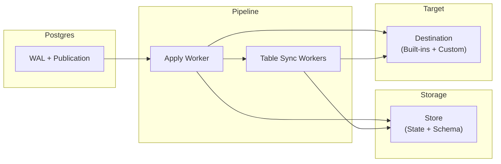

Supabase ETL uses **Postgres logical replication** to initially sync published
tables, then replicate subsequent changes to a destination in near real time.

## Overview

## How It Works

ETL operates in **two phases**:

### Phase 1: Initial Sync

When a pipeline starts, it copies existing rows from each table in the
publication, then catches up changes that occurred while the copy was running.
Multiple **Table Sync Workers** run in parallel. Each worker:

1. Creates a replication slot to capture a consistent snapshot
2. Copies existing rows with Postgres `COPY` and sends them via `write_table_rows()`
3. Catches up later WAL changes via `write_events()` until the table is ready
   for the apply worker

<Callout className="etl-callout" type="info" title="Note">
  During catch-up, `Begin` and `Commit` events may be delivered multiple times
  because workers consume slots in parallel. This is expected: destinations
  should rely on **per-table event ordering** and **idempotent writes** rather
  than treating transaction markers as a complete global transaction boundary.
</Callout>

Copy and change data capture (CDC) are replication paths, not customer-visible
phases. Initial sync uses the copy path followed by CDC catch-up; ongoing
replication uses the CDC path after the table is ready.

### Phase 2: Ongoing Replication

Once a table is ready, the **Apply Worker** handles ongoing replication from
the Postgres WAL. It:

1. Receives change events (inserts, updates, deletes, truncates, and schema changes)
2. Batches events for efficiency
3. Sends batches to the destination via `write_events()`

### Schema Changes

ETL supports simple column evolution from `ALTER TABLE` and supported
`ALTER PUBLICATION` changes. A source-side event trigger emits internal schema
messages for published permanent tables, ETL stores a new schema snapshot, and
destinations observe the change through a fresh `Relation` event before
following row events. See [Schema Changes](/explanation/schema-changes/) for
the supported operations and limitations.

## Core Components

### Pipeline

The **central orchestrator** that manages the entire replication process. It spawns workers, coordinates state transitions, and handles shutdown.

### Destination

The `Destination` trait receives bulk rows during initial sync and event batches
during catch-up and ongoing replication. Result handles let a destination distinguish
accepted work from durable work without blocking dispatch. See [Extension
Points](/explanation/traits/#destination) for the method contract and [Custom
Implementations](/guides/custom-implementations/) for an example.

### Store

Three store traits persist the state needed to resume after restarts:

- **StateStore**: Tracks table state, persisted replication checkpoints, and destination table metadata
- **SchemaStore**: Stores versioned table schema information (columns, types, primary keys, snapshot IDs) and prunes obsolete schema versions behind persisted checkpoints while preserving the retained boundary schema and newer versions
- **TableStateLifecycleStore**: Prepares table-copy state, resets table states for resync, and deletes all ETL-owned state when a table leaves the publication

See [Extension Points](/explanation/traits/#schemastore) for the cache and
durability contracts.

## Delivery Guarantees

ETL provides **at-least-once delivery**. If restarts occur, some events may be delivered more than once. This is a deliberate design choice.

### Why Not Exactly-Once?

Exactly-once delivery requires distributed transactions between Postgres and the destination, adding complexity and latency. Instead, ETL optimizes for throughput and simplicity while minimizing duplicates through:

- **Controlled shutdown**: The pipeline attempts to finish in-flight work before its shutdown deadline; interrupted work can be replayed after restart
- **Frequent status updates**: Progress is reported to Postgres regularly, reducing the replay window after restarts

### Handling Duplicates

Destinations should make writes **idempotent** using the source table's replica
identity or primary key plus ETL's event ordering metadata. For append-style CDC
tables, persist a sequence key derived from `commit_lsn` and `tx_ordinal`. For
current-state tables, upsert by the destination's chosen row key so replayed
events converge to the same state.

The `commit_lsn` and `tx_ordinal` fields on sequenced events provide stable
**ordering and checkpointing**. Destinations such as ClickHouse and BigQuery
use the pair to keep replayed events ordered. See [Event
Types](/explanation/events/#understanding-event-sequence-keys) for details.

## Table States

Each table progresses through these states. See
[Extension Points](/explanation/traits/#table-states) for which states are
persisted across restarts.

| State | Set By | Description |
|-------|--------|-------------|
| **Init** | Pipeline | Table discovered, ready for initial sync |
| **DataSync** | Table Sync Worker | Initial table copy in progress |
| **FinishedCopy** | Table Sync Worker | Copy complete, waiting for catch-up coordination |
| **SyncWait** | Table Sync Worker | Waiting for Apply Worker to pause (in-memory only) |
| **Catchup** | Apply Worker | Apply Worker paused; Table Sync Worker catching up to its LSN (in-memory only) |
| **SyncDone** | Table Sync Worker | Catch-up complete; durable decoder retained until Apply materializes local state |
| **Ready** | Apply Worker | Apply Worker now handles this table exclusively |
| **Errored** | Either | Error occurred; contains reason, solution hint, and retry policy |
