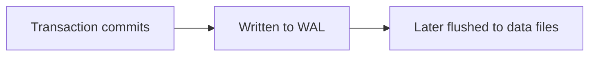
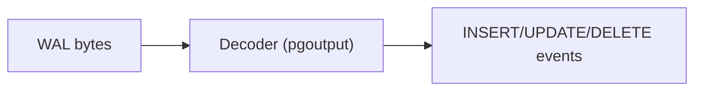

Read this first if Postgres logical replication is new to you.

## What is Logical Replication?

Postgres supports two types of replication:

| Type | What it copies | Use case |
|------|----------------|----------|
| **Physical** | Exact byte-for-byte copy of data files | Disaster recovery, read replicas |
| **Logical** | Decoded row changes (INSERT, UPDATE, DELETE) | Data integration, ETL, CDC |

ETL uses logical replication because decoded row changes can be sent to systems
other than Postgres.

## The Write-Ahead Log (WAL)

Before Postgres modifies data on disk, it first writes the change to the **Write-Ahead Log (WAL)**. This guarantees durability: if Postgres crashes, it can replay the WAL to recover.



For logical replication, Postgres decodes the WAL back into **logical changes**:



ETL receives these decoded events and forwards them to downstream consumers.

### WAL Level

Postgres must be configured to record enough information for logical decoding:

```ini
# In postgresql.conf
wal_level = logical
```

With `wal_level = logical`, Postgres records additional metadata needed to reconstruct row changes. Lower levels (`replica`, `minimal`) **do not capture enough detail**.

## Publications

A **publication** defines which tables to replicate. Think of it as a filter that says "replicate changes from these tables."

```sql
-- Replicate specific tables
CREATE PUBLICATION my_publication FOR TABLE users, orders;

-- Replicate all tables (use with caution)
CREATE PUBLICATION my_publication FOR ALL TABLES;
```

When you create an ETL pipeline, you specify which publication to consume.
**Only tables and operations selected by that publication are replicated.**

### What Publications Control

- **Which tables**: Only tables in the publication are replicated
- **Which operations**: You can filter to only INSERT, UPDATE, or DELETE
- **Which columns** (Postgres 15+): Replicate only specific columns
- **Which rows** (Postgres 15+): Filter rows with a WHERE clause

## Replication Slots

A **replication slot** is a bookmark that tracks how far a consumer has read in the WAL.

### Why Slots Exist

Without slots, Postgres would delete old WAL files when it no longer needs them for crash recovery. If ETL disconnects temporarily, it needs those WAL files to catch up when it reconnects.

Replication slots tell Postgres: **"Don't delete WAL files until this consumer has processed them."**

```sql
-- View existing slots
SELECT slot_name, confirmed_flush_lsn, active
FROM pg_replication_slots;
```

### How ETL Uses Slots

ETL creates replication slots automatically:

| Slot | Purpose |
|------|---------|
| `supabase_etl_apply_{pipeline_id}` | Main slot for ongoing replication |
| `supabase_etl_table_sync_{pipeline_id}_{table_id}` | Temporary slots for initial sync |

The Apply Worker uses one persistent slot. Table Sync Workers create temporary slots during initial sync, then delete them.

### Slot Risks

Slots prevent WAL cleanup. If ETL stops consuming because of crashes, network issues, or a slow consumer, WAL files accumulate on disk. **This can fill your disk.**

To mitigate this risk:

- Monitor slot lag with `pg_replication_slots`
- Set `max_slot_wal_keep_size` to limit WAL retention
- Alert when slots fall behind

See [Configure Postgres](/guides/configure-postgres/#wal-buildup-and-disk-usage) for details.

## The pgoutput Decoder

When Postgres decodes WAL for logical replication, it uses a **decoder plugin**. ETL uses `pgoutput`, Postgres's built-in decoder.

The decoder transforms binary WAL records into structured messages:

| Message | Meaning |
|---------|---------|
| `BEGIN` | Transaction started |
| `RELATION` | Table schema (columns, types) |
| `INSERT` | Row added |
| `UPDATE` | Row modified |
| `DELETE` | Row removed |
| `TRUNCATE` | Table cleared |
| `COMMIT` | Transaction completed |

ETL receives these messages and converts them to events.

## Why Two Phases?

ETL replicates data in two phases: **initial sync** and **ongoing
replication**.

### Phase 1: Initial Sync

Logical replication only captures **changes**. It does not know about data that existed before replication started.

So ETL first copies existing rows using Postgres's `COPY` command, then catches
up WAL changes that arrived during the copy:

1. Create a replication slot (captures a consistent snapshot point)
2. `COPY` all rows from the table via `write_table_rows()`
3. Catch up later changes via `write_events()` until the table is ready

The slot ensures **no changes are lost** between the snapshot and ongoing
replication.

### Phase 2: Ongoing Replication

After initial sync, ETL begins ongoing replication. It captures subsequent
changes from the WAL and delivers them to the destination:


Each change is delivered as an `Event` through `write_events()`.

Large tables can spend significant time in initial sync. ETL exposes separate
`write_table_rows()` and `write_events()` methods so destinations can optimize
initial-copy rows and change events independently.

## Replica Identity

**REPLICA IDENTITY** controls what old-row data Postgres includes in `UPDATE`
and `DELETE` events.

```sql
-- See current setting (d=default, f=full, n=nothing, i=index)
SELECT relname, relreplident FROM pg_class WHERE relname = 'your_table';

-- Change setting
ALTER TABLE your_table REPLICA IDENTITY FULL;
```

| Setting | What consumers get |
|---------|--------------------|
| `DEFAULT` with a primary key | Key columns on deletes; key columns on updates only when Postgres needs them |
| `FULL` | Full old row on every published update and delete |
| `USING INDEX` | Index columns instead of the primary key, with the same update caveat as `DEFAULT` |
| `NOTHING`, or `DEFAULT` without a primary key | Source `UPDATE`/`DELETE` is rejected when those operations are published |

Set `REPLICA IDENTITY FULL` when destinations need complete old rows, before/after
comparison, or reliable reconstruction of unchanged TOAST columns. See
[Events](/explanation/events/#old-row-mapping) for the exact pgoutput mapping
and partial-update behavior.

## LSN (Log Sequence Number)

Every position in the WAL has a unique **LSN** - a monotonically increasing pointer.

```text
Format: 0/16B3748 (segment/offset)
```

### LSNs in Events

Sequenced ETL events include a commit LSN and transaction-local ordinal:

| Field | Meaning |
|-------|---------|
| `commit_lsn` | LSN of the commit message in the WAL |
| `tx_ordinal` | Zero-based event order within the transaction |

Multiple events in the same transaction share the same `commit_lsn`; their
`tx_ordinal` values distinguish their order. Relation events are connection-local
metadata and do not have an event sequence key.

## Persisted State

ETL persists the state needed to resume safely after a restart:

ETL stores:

| State | Purpose |
|-------|---------|
| Table state | Track each table from initial sync through ongoing replication |
| Persisted replication checkpoint | Resume workers from a safe replay frontier |
| Table schemas | Decode events against the correct versioned schema |
| Destination table metadata | Track destination table IDs, applied schema snapshots, and replication masks |

The built-in `PostgresStore` persists to your Postgres database and runs its
state-store migrations when it is created. If the pipeline reads from a
read-only replica, configure `store_pg_connection` to point at a writable
Postgres endpoint for this state. `MemoryStore` is for testing only - state is
lost on restart. `Pipeline::start()` runs the ETL source migrations that install
schema helpers and the DDL event trigger before replication begins. See
[Architecture](/explanation/architecture/) for the worker lifecycle and
[Configure Postgres](/guides/configure-postgres/) for production settings.
